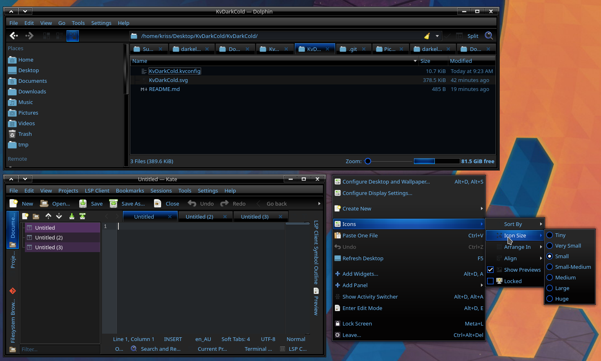

# DarkCold Kvantum KDE theme by OriginalSeed

## Description

DarkCold, a sleek dark skeuomorphic KDE/Kvantum theme. Ported from GTK theme that dates back to 2010.

## Requirements

### Kvantum

Info: https://github.com/tsujan/Kvantum/tree/master/Kvantum

Install: https://github.com/tsujan/Kvantum/blob/master/Kvantum/INSTALL.md

### GTK theme (optional for consistency)
https://www.gnome-look.org/p/1080259/

### Window Decoration (optional)
https://www.gnome-look.org/p/2109407

