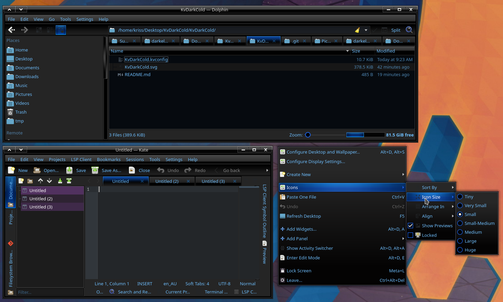
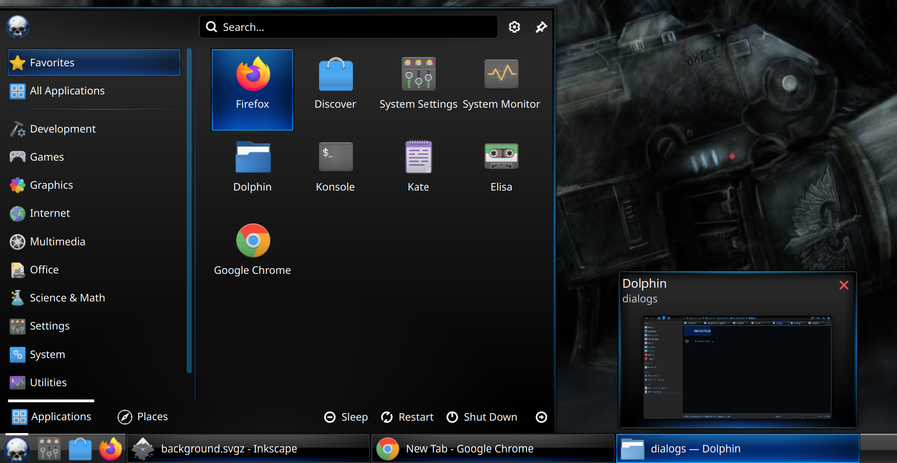

# DarkCold Theme for KDE

## Content

- KvDarkcold - Kvantum theme - https://store.kde.org/p/2111726 
- plasma/plasma6darkcold - Plasma 6 Theme - https://store.kde.org/p/2217298
- plasma/plasma5darkcold - Plasma 5 Theme
- color-scheme - Darkcold color scheme - https://store.kde.org/p/2355076/
- org.originalseed.darkcold - Global theme

Additional: Plasma Window Decoration: https://store.kde.org/p/2109407

# DarkCold Kvantum KDE theme by OriginalSeed

## Description

DarkCold, a sleek dark skeuomorphic KDE/Kvantum theme. Ported from GTK theme that dates back to 2010.

## Requirements

### Kvantum

Info: https://github.com/tsujan/Kvantum/tree/master/Kvantum

Install: https://github.com/tsujan/Kvantum/blob/master/Kvantum/INSTALL.md

### GTK theme (optional for consistency)
https://www.gnome-look.org/p/1080259/

### Window Decoration (optional)
https://www.gnome-look.org/p/2109407

# DarkCold Plasma 6 and Plasma 5 KDE theme by OriginalSeed

